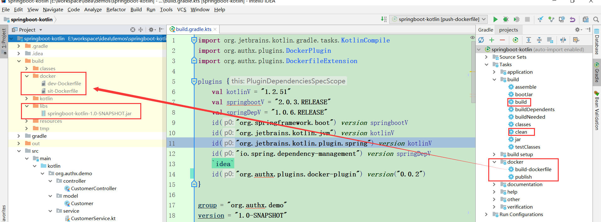

# 1 插件开发过程

spring boot项目，尤其是spring cloud搭建的微服务，每个服务都需要发布至少一个节点。如果发布多个节点，且使用docker，需要敲一堆的命令。

整个发布的流程看起来复杂，但是，拆分开来，也没多少东西。

所以，我想，功能还是可以实现的：

**按照默认的约定，只需很少的配置，将gradle打包好的jar自动发布成多个docker container。**

分步骤实现自定义的docker plugin


## 1.1 v0.1

| 功能点              | 描述                                              |
| ------------------- | ------------------------------------------------- |
| build dockerfile    | dockerfile的内容，使用kotlin的模板字符串          |
| connect docker host | 使用jsch连接linux                                 |
| push dockerfile     | 上传dockerfile到`/opt/${project.name}/Dockerfile` |

## 1.2 v0.2

| 功能点               | 描述                          |
| -------------------- | ----------------------------- |
| push jar             | 上传本地的jar到linux          |
| build docker image   | 通过dockerfile构建docker 镜像 |
| run docker container | 运行1个docker容器             |

# 2 使用插件

## 2.1 指定插件的仓库

自定义的插件，自然是push到了本地的仓库。需要单独配置

修改`settings.gradle.kts`

```
pluginManagement {
    repositories {
        mavenLocal()
        mavenCentral()
        gradlePluginPortal()
    }
}

rootProject.name = "springboot-kotlin"
```

## 2.2 import plugin

配置`build.gradle.kts`

```
plugins {
    id("org.authx.plugins.docker-plugin") version("0.0.2")
}
```

> 新版本的gradle，尤其是使用kotlin的脚本，推荐使用这种配置方式。
>
> 其中，
>
> - 每个插件都需要唯一的id
> - 声明一次即可，不需要重复命令：`apply<XXXPlugin>（）`

## 2.3 重新构建项目

构建完成后，在view gradle中，会新增两个自定义的task。如下：




## 2.4 publish的过程

详情见`docs/v${version}.md`，里面有具体的操作