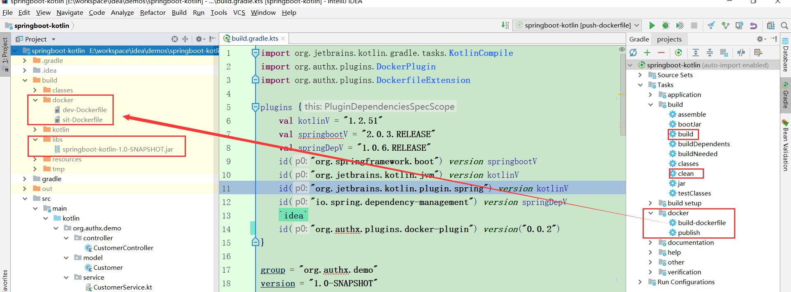
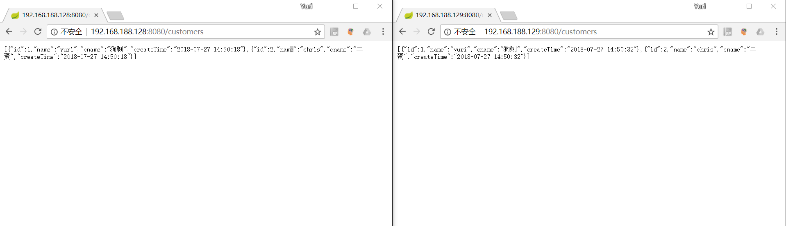
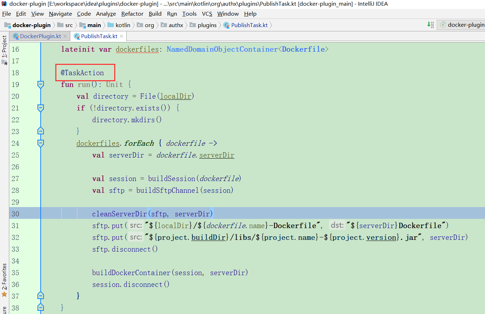

约定：

| 项目名称          | 描述           |
| ----------------- | -------------- |
| docker-plugin     | 插件源码       |
| springboot-kotlin | 使用插件的项目 |

# 1 使用插件

## 1.1 build.gradle.kts

```
plugins {
    id("org.authx.plugins.docker-plugin") version("0.0.2")
}
configure<DockerfileExtension> {
    dockerfiles{
        "dev"{
            host = "192.168.188.128"
            username = "root"
            password = "123456"
            serverDir = "/opt/${project.name}"
            context = """
                    FROM java:openjdk-8-jre-alpine
                    COPY ${project.name}-${project.version}.jar /opt/${project.name}/
                    EXPOSE 8080
                    ENTRYPOINT ["java", "-jar", "/opt/${project.name}/${project.name}-${project.version}.jar"]
                """
        }
        "sit"{
            host = "192.168.188.129"
            username = "root"
            password = "123456"
            serverDir = "/opt/${project.name}"
            context = """
                    FROM java:openjdk-8-jre-alpine
                    COPY ${project.name}-${project.version}.jar /opt/${project.name}/
                    EXPOSE 8080
                    ENTRYPOINT ["java", "-jar", "/opt/${project.name}/${project.name}-${project.version}.jar"]
                """
        }
    }
}
```

## 1.2 部署项目前的准备

- 两台linux的机器（vmware）。且，根据实际情况，修改`build.gradle.kts -> host & username & password`

- 安装docker

- 关闭linux的防火墙

> spring boot的项目会跑在linux上面，且开放相应的端口（8080）；有防火墙的话，这些自定义的的端口，外部机器是不能访问的。可以修改iptables的映射策略，但是，太麻烦了。测试的时候，直接关闭防火墙就够了

```
[root@yuri ~]# vim /etc/selinux/config 
```

```
SELINUX=disabled
```

```
[root@yuri /]# reboot now
```
## 1.3 pubish的流程

- gradle原生的命令
  - clean project
  - build project
- 自定义插件的命令
  - build dockerfile
  - push



## 1.4 测试



# 2 插件源码

> 文档着重介绍代码的流程

## 2.1 定义task

```
task("publish", PublishTask::class) {
            group = "docker"

            doFirst {
                localDir = extension.localDir
                dockerfiles = extension.dockerfiles
            }

        }
```

## 2.2 实现PublishTask

`PublishTask#run()`

> 所有自定义的Task，入口都是有注解@TaskAction的方法

